# Backend Roadmap 🚀

This roadmap is designed to guide you from foundational knowledge to mastering the skills of a senior backend developer. Follow this structured path to gain the necessary expertise.

## **🎨 Color Coding Explanation**

### **🟣 Personal Recommendation / Opinion**
These are highly recommended skills or technologies based on industry standards and trends.

### **🟢 Alternative Option / Pick This or Purple**
These are optional alternatives; you can choose them based on your preferences or project needs.

### **⚪ Order Not Strict / Learn Anytime**
These skills or technologies can be learned in any order depending on your progress and requirements.

---

## **Graphical Representation**

```mermaid
graph LR;
  A[Backend] --> B[Internet];
  B --> B1[How does the Internet Work? 🟣];
  B --> B2[What is HTTP? 🟣];
  B --> B3[What is Domain Name? 🟣];
  B --> B4[What is Hosting? 🟣];
  B --> B5[DNS and How it Works? 🟣];
  B --> B6[Browsers and How They Work? 🟣];

  A --> C[Pick a Language];
  C --> C1[JavaScript 🟣];
  C --> C2[Python 🟢];
  C --> C3[Java 🟢];
  C --> C4[PHP 🟢];
  C --> C5[Go 🟣];
  C --> C6[Ruby 🟢];
  C --> C7[C# 🟢];
  C --> C8[Rust 🟢];

  A --> D[Version Control Systems];
  D --> D1[Git 🟣];
  D --> D2[Repo Hosting Services];
  D2 --> D3[GitHub 🟣];
  D2 --> D4[GitLab 🟢];
  D2 --> D5[Bitbucket 🟢];

  A --> E[Relational Databases];
  E --> E1[PostgreSQL 🟣];
  E --> E2[MySQL 🟢];
  E --> E3[MariaDB 🟢];
  E --> E4[MS SQL 🟢];
  E --> E5[Oracle 🟢];
  E --> E6[SQLite 🟢];

  A --> F[Learn About APIs];
  F --> F1[REST 🟣];
  F --> F2[JSON APIs 🟣];
  F --> F3[SOAP ⚪];
  F --> F4[gRPC ⚪];
  F --> F5[GraphQL ⚪];
  F --> F6[HATEOAS ⚪];
  F --> F7[Open API Specs ⚪];

  A --> G[Authentication];
  G --> G1[JWT 🟣];
  G --> G2[OAuth 🟣];
  G --> G3[Basic Authentication 🟣];
  G --> G4[Token Authentication 🟣];
  G --> G5[Cookie-Based Auth 🟣];
  G --> G6[OpenID ⚪];
  G --> G7[SAML ⚪];

  A --> H[Caching];
  H --> H1[Redis 🟣];
  H --> H2[Memcached 🟢];
  H --> H3[Server-Side Caching 🟣];
  H --> H4[Client-Side Caching 🟣];

  A --> I[Web Security];
  I --> I1[HTTPS 🟣];
  I --> I2[CORS 🟣];
  I --> I3[CSP 🟣];
  I --> I4[SSL/TLS 🟣];
  I --> I5[Server Security 🟣];
  I --> I6[API Security Best Practices 🟣];

  A --> J[Testing];
  J --> J1[Unit Testing 🟣];
  J --> J2[Integration Testing 🟣];
  J --> J3[Functional Testing 🟣];

  A --> K[Software Design & Architecture];
  K --> K1[Design Patterns 🟣];
  K --> K2[Domain-Driven Design 🟣];
  K --> K3[Test-Driven Development 🟣];
  K --> K4[Event Sourcing ⚪];
  K --> K5[CQRS ⚪];

  A --> L[Containerization & Virtualization];
  L --> L1[Docker 🟣];
  L --> L2[Kubernetes 🟢];

  A --> M[Message Brokers];
  M --> M1[RabbitMQ 🟢];
  M --> M2[Kafka 🟣];

  A --> N[NoSQL Databases];
  N --> N1[MongoDB 🟣];
  N --> N2[CouchDB 🟢];
  N --> N3[Redis 🟣];
  N --> N4[DynamoDB 🟢];

  A --> O[Real-Time Data];
  O --> O1[Server-Sent Events 🟣];
  O --> O2[WebSockets 🟣];
  O --> O3[Long Polling 🟣];
  O --> O4[Short Polling 🟣];

  A --> P[Building for Scale];
  P --> P1[Load Shifting 🟣];
  P --> P2[Throttling 🟣];
  P --> P3[Backpressure 🟣];
  P --> P4[Circuit Breaker 🟣];
  P --> P5[Types of Scaling 🟣];
  P --> P6[Migration Strategies 🟣];

  %% Styles for categories
  classDef purple fill:#e1d5e7,stroke:#800080,stroke-width:2px,color:#000,font-weight:bold;
  classDef green fill:#d9ead3,stroke:#38761d,stroke-width:2px,color:#000,font-weight:bold;
  classDef gray fill:#f3f3f3,stroke:#999999,stroke-width:2px,color:#000,font-weight:bold;

  %% Assign styles to nodes
  class B1,B2,B3,B4,B5,B6,C1,C5,D1,D3,E1,F1,F2,G1,G2,H1,H3,H4,I1,I2,I3,I4,I5,I6,J1,J2,J3,K1,K2,K3,L1,M2,N1,N3,O1,O2,O3,O4,P1,P2,P3,P4,P5,P6 purple;
  class C2,C3,C4,C6,C7,C8,D4,D5,E2,E3,E4,E5,E6,F3,F4,F5,F6,F7,G6,G7,H2,L2,M1,N2,N4 green;
  class F7,K4 gray;
```

