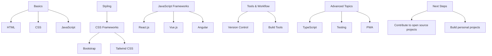

```mermaid
graph TD;
  A[Basics] --> B[HTML];
  A --> C[CSS];
  A --> D[JavaScript];
  E[Styling] --> F[CSS Frameworks];
  F --> G[Bootstrap];
  F --> H[Tailwind CSS];
  I[JavaScript Frameworks] --> J[React.js];
  I --> K[Vue.js];
  I --> L[Angular];
  M[Tools & Workflow] --> N[Version Control];
  M --> O[Build Tools];
  P[Advanced Topics] --> Q[TypeScript];
  P --> R[Testing];
  P --> S[PWA];
  T[Next Steps] --> U[Contribute to open source projects];
  T --> V[Build personal projects];
```
